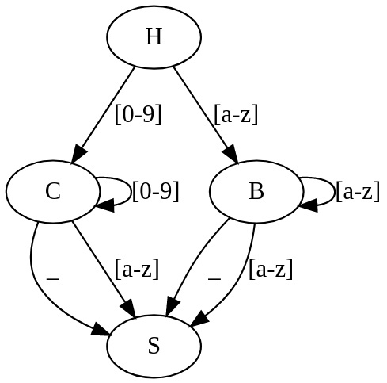
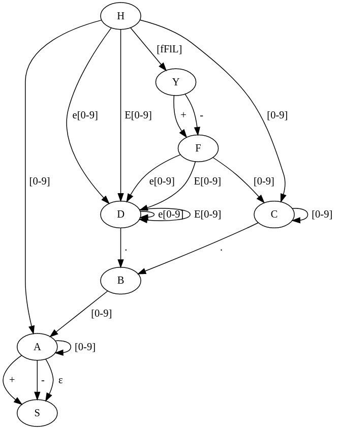

№ 1. Дана грамматика. Постройте вывод заданной цепочки.
a) цепочка: a - b * a + b
грамматика:

S -> T | T + S | T - S
T -> F | F * T
F -> a | b

__S__ -> __T__ - S -> __F__ - S -> a - __S__ -> a - __T__ + S -> a - __F__ * T + S ->
-> a - b * __T__ + S -> a - b * __F__ + S -> a - b * a + __S__ -> 
-> a - b * a + __T__ -> a - b * a + __F__ -> a - b * a + b

b) цепочка: aaabbbccc
грамматика:

S -> aSBC | abC
CB -> BC
bB -> bb
bC -> bc
cC -> cc

__S__ -> a __S__ BC -> aa __S__ BCBC -> aaab __CB__ CBC -> aaa __bB__ CCBC -> 
-> aaabbC __CB__ C -> aaabb __CB__ CC -> aaab __bB__ CCC -> aaabb __bC__ CC ->
-> aaabbb __cC__ C -> aaabbbc __cC__ -> aaabbbccc

№ 2. Построить грамматику порождающую язык:

a) L = {a^n b^m c^k | n,m,k > 0}

G ({a, b, c}, {S, B, C}, P, S)

P:
S -> aS | aB
B -> bB | bC
C -> cC | c

1) __S__ -> a __B__ -> ab __C__ -> abc
2) __S__ -> a __S__ -> aa __B__ -> aab __B__ -> aabb __B__ -> aabbb __C__ -> aabbbc

b) L = {0^n (10)^m | n,m >= 0}

G ({0, 1}, {S, T}, P, S)

P:
S -> 0S | T
T -> 10T | 10 | _ε_

1) __S__ -> 0 __S__ -> 00 __S__ -> 000 __S__ -> 000 __T__ -> 00010 __T__ -> 0001010 __T__ -> 000101010
2) __S__ -> __T__ -> _ε_

c) L = {a1,a2,...,an,an,...,a2,a1 | ai = {0, 1}}

G ({0, 1}, {S, A}, P, S)

P:
S -> 0A0 | 1A1
A -> 0A0 | 1A1 | _ε_

1) __S__ -> 0 __A__ 0 -> 01 __A__ 10 -> 010 __A__ 010 -> 0101 __A __1010 -> 01011010
2) __S__ -> 0 __A__ 0 -> 00

№ 3. К какому типу по Хомскому относится грамматика с приведенными правилами? Аргументируйте ответ.

a)

S -> 0A1 | 01
__->__ __0__ A -> 00A1
A -> 01

Контекстно-зависимая, так как слева во второй строке есть терминал.

b)

S -> Ab
A -> Aa | __ba__ __<-__ 

Контекстно-свободная. В левой части нет терминалов. Не может быть регулярной,
так как в правой части второй строки находится вариант с двумя терминалами.

№ 4. Построить КС-грамматику, эквивалентную грамматике с правилами:

S -> AB | ABS
AB  -> BA
BA  -> AB
A -> a
B -> b

КС-грамматика:

S -> T | TS
T -> ab | ba

№ 5. Построить регулярную грамматику, эквивалентную грамматике с правилами:

S -> A __.__ A
A -> B | BA
B -> 0 | 1

Регулярная грамматика:

S -> A
A -> 0A | 1A | __.__ B
B -> 0 | 1

№ 6. Напишите регулярное выражение для:

a) множества идентификаторов, где идентификатор – это последовательность букв или цифр, начинающаяся с буквы или _;

1. Регулярное выражение:

\[_a-zA-Z](([a-zA-Z]+)|([0-9]+))

2. Данные для тестов:
_string
a123
123
_123
string123
123string
_123string

3. Ссылка на тесты: https://regexr.com/6h9lh

b) множества вещественных констант с плавающей точкой, состоящих из целой части, десятичной точки, дробной части, символа е или Е, целого показателя степени с необязательным знаком и необязательного суффикса типа – одной из букв f, F, l или L. Целая и дробная части состоят из последовательностей цифр. Может отсутствовать либо целая, либо дробная часть (но не обе сразу).

1. Регулярное выражение:

(((\+|\-)?)[0-9]+)(((\.?)(([0-9]+)|(e|E)[0-9]+)(((\+|\-)[fFlL])?))?)

2. Данные для тестов:
string
313.135.1135
0.5
0\.
.0
string.0
12.E5
12.E3+
12.E3+F

3. Ссылка на тесты: https://regexr.com/6h9lb

№ 7. Для регулярных выражений из предыдущего задания постройте конечные автоматы. Изобразите их в виде графа.

a)

b)
